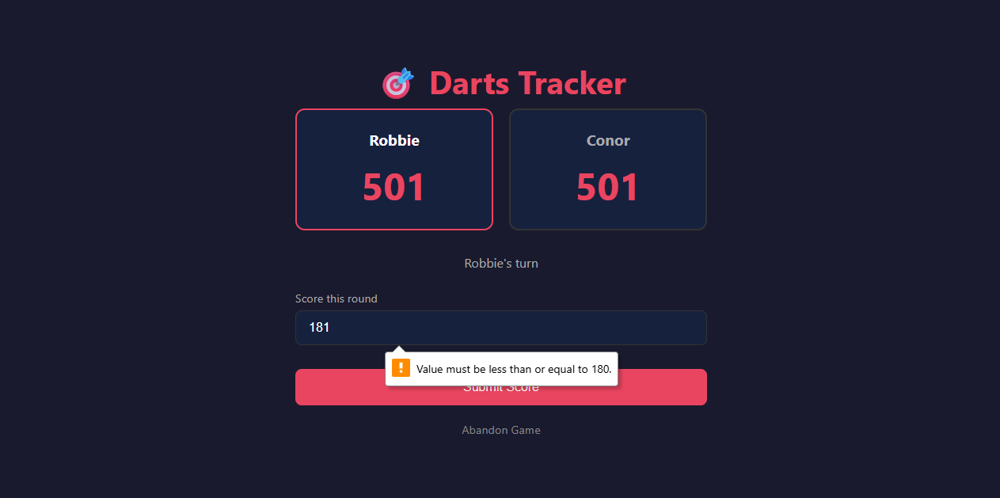

# Darts Tracker

A web application built with Python, Flask, HTML and CSS which allows two players to track their scores in a game of 501 or 301 darts.

## Screenshot

## Features

Darts Tracker is able to:
- Set up a game between two players with a choice of 501 or 301 (full length game or shortened)
- Track and subtract scores each round automatically
- Detect and handle bust scores, passing the turn to the other player
- Prevent invalid finishes by treating a remaining score of 1 as a bust (as in darts, you must finish with a double. Double 1 = 2, therefore remaining score cannot be less than 2.)
- Declare a winner when a player checks out on exactly zero
- Reset and start a new game at any time

## Tech Stack

- Python 3.14
- Flask - lightweight web framework
- Jinja2 - HTML templating
- HTML & CSS - frontend interface
- Session management - game state tracking between requests

## How to Run

1. Clone the repository
2. Create a virtual environment: `python -m venv venv`
3. Activate it: `venv\Scripts\activate`
4. Install dependencies: `pip install -r requirements.txt`
5. Run the app: `python app.py`
6. Open your browser and go to `http://127.0.0.1:5000`

## Author

Robbie Nimick - https://github.com/RobbieNimick